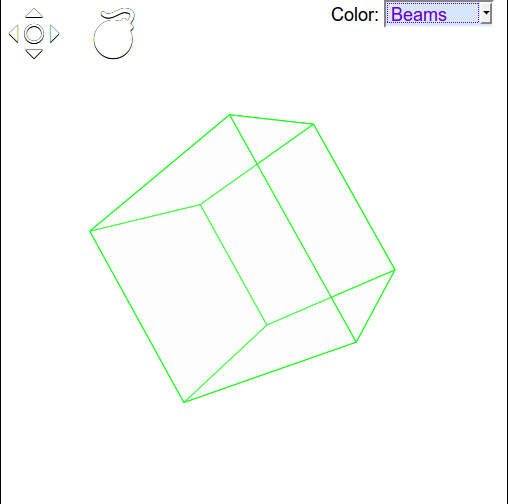
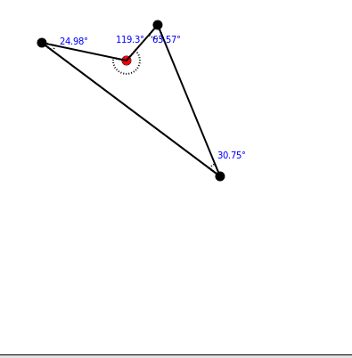
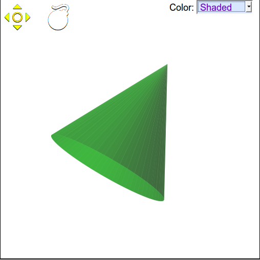

# PiShape
An Application shows how the geometric shapes interactive



# Usage

After installing [typescript](http://www.typescriptlang.org)

In root directory run command.

```html
tsc -out <returend.js> app/<2d | 3d>.ts
```

File named `2d.ts` for generating 2D shapes code file :




And `3d.ts`:



### 3D Usages:

After generating 3d.ts. Add following lines to project
```html
<link rel="stylesheet" href="<dir>/assets/pi.style.css"/>
<script src="<link_to_your_js_generated_name>.js"></script>
```
And then, to usage simply call
```
P$.init({
  parentId: 'canvas', // the id's parent which contains our canvas element
  shapeName: 'dodecahedron' // name of shape
});
```

### 3d shapes now support below shapes :
  1. net
  2. cone
  3. square-pyramid
  4. pent-pyramid
  5. tetrahedron
  6. irr-tetrahedron
  7. cylinder
  8. tri-prism-n
  9. tri-prism
  10. cube
  11. cuboid
  12. rect-prism
  13. pent-prism
  14. strange-prism
  15. octahedron
  16. dodecahedron
  17. icosahedron-intersected
  18. icosahedron
  
### updating
